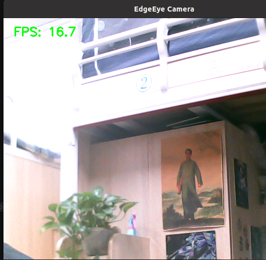

# EdgeEye

A Linux-based real-time vision monitoring system built with C++ and OpenCV.

## Overview

EdgeEye is a Linux vision framework designed for real-time camera processing and future AI vision applications.

The project is developed incrementally, starting from camera acquisition and gradually evolving into a complete edge AI vision system.

---

## Features

Current features include:

- USB camera capture
- Real-time camera preview
- FPS monitoring
- CMake build system
- Modular C++ project architecture

### Planned Features

- Screenshot capture
- Video recording
- Multithreaded camera pipeline
- Qt graphical interface
- Serial communication with STM32
- YOLO object detection
- Edge AI inference

---

## Project Structure

```text
EdgeEye
│
├── CMakeLists.txt
├── README.md
│
├── include/
│   ├── camera.hpp
│   └── fps.hpp
│
├── src/
│   ├── main.cpp
│   ├── camera.cpp
│   └── fps.cpp
│
└── build/
```

---

## Environment

- Ubuntu
- GCC
- CMake
- OpenCV

---

## Build

```bash
mkdir build
cd build
cmake ..
make
```

---

## Run

```bash
./EdgeEye
```

---

## Version History

### v0.3

- Added FPS counter module
- Display real-time FPS on the camera preview
- Introduced modular performance monitoring

### v0.2

- Integrated OpenCV
- Added USB camera capture
- Implemented real-time camera preview
- Added modular camera class

### v0.1

- Initial project setup
- C++ project structure
- CMake build system
- Basic executable framework